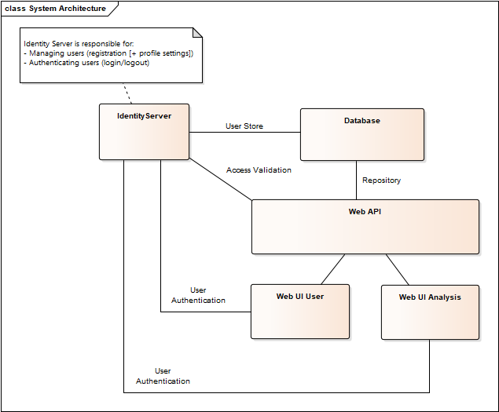

# SmartCar Backend
The backend consists of several services that are indipendently deployed to their own docker containers. 
- **Identity Server**
Manages the users for the whole smart car application. Supports login via open id and oauth 2.
- **Database**
Stores the user data of the identity server as well as the application data.
- **Web API**
Processes the uploaded car data.
- **Web UI**
Offers a webinterface to the users to watch the processed data that is calculated and deliverd by the web api.

## Setup
To run the backend on your local machine, execute the following steps:
1. Checkout the backend project from [Backend](https://github.com/Itiapu/HSPSmartCar/tree/master/Backend).
2. Open a shell and navigate to Backend/SmartCar
3. Run `docker-compose up`
4. The startup of the identity server will fail because of timing problems. Simply restart the dock container manually.

### Dependencies
The following software should be installed on the target:
- Docker
- Docker Compose
*Already included in windows installation.*
- (Kitematics) 
*Useful to manage your running containers if you are setting up a developement environment on windows.*

