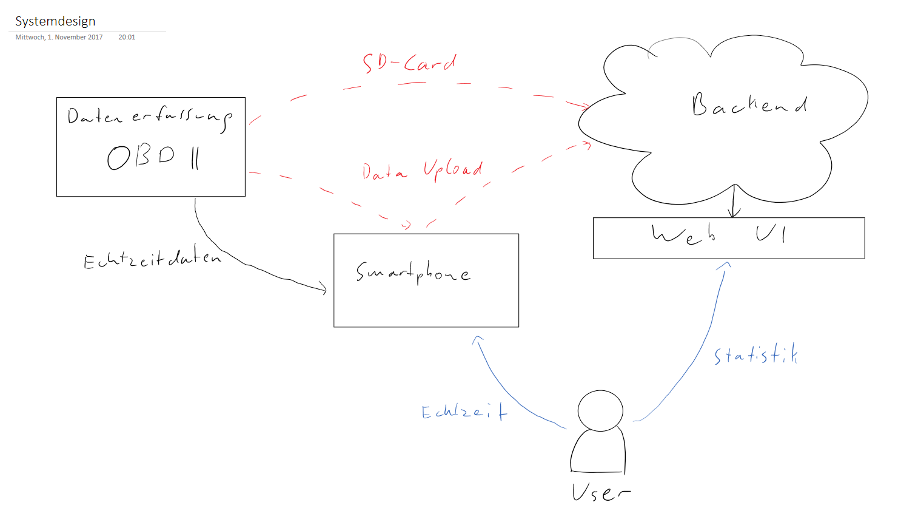

# HSPSmartcar

HSPSmartCar has been developed during a student project at OTH Regensburg. The general purpose is to collect data from cars by using a [FreematicsOne-Dongle](https://freematics.com/pages/products/freematics-one/) and the cars OBD-II Interface. 
The data can be displayed on a Smartphone App as well as in a self developed Backend.

Feel free to contribute.

